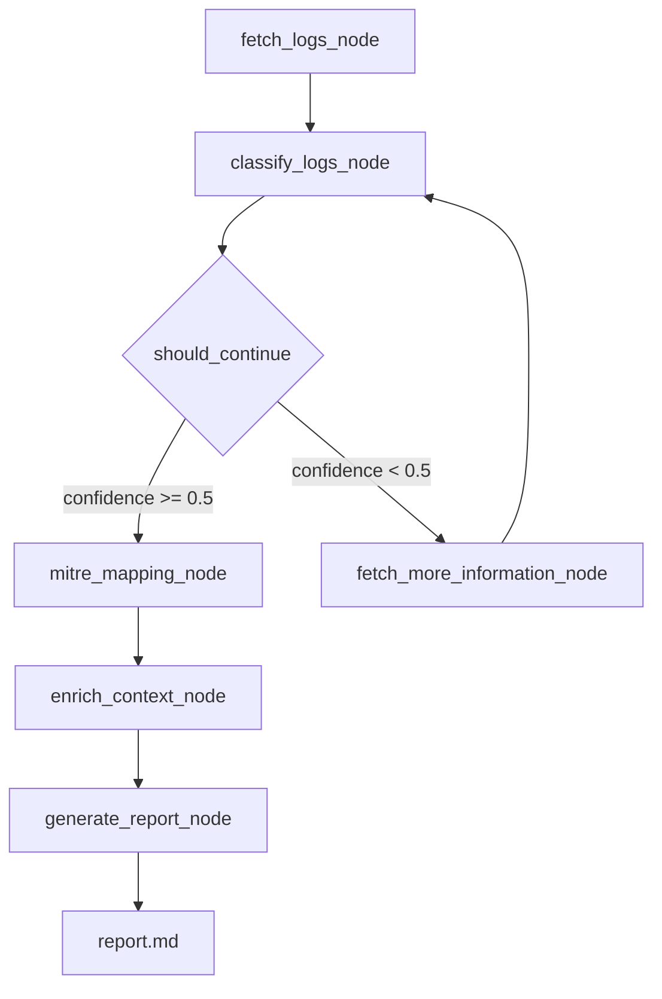

# 🛡️ AI Threat Hunting Agent

An autonomous AI-powered threat hunting agent built with LangGraph, GPT-4o-mini, and Elastic SIEM. It fetches real attack logs, classifies threats, maps them to the MITRE ATT&CK framework, enriches context, and generates a formal SOC-ready incident report - all without human intervention.

> What takes a threat hunter 5-11 hours manually, this agent does in under 60 seconds.

---

## 🎥 Demo

https://github.com/user-attachments/assets/028b58d5-e304-4063-82d0-a3be0d783cda

---

## 🧠 How It Works

The agent is built as a LangGraph state machine where each node has a specific job. Here's the full flow:



### Nodes

| Node | What it does |
|------|-------------|
| `fetch_logs_node` | Fetches Sysmon EventID 1 (Process Creation) logs from Elastic SIEM |
| `classify_logs_node` | Sends logs to GPT-4o-mini to identify suspicious activity and return a confidence score |
| `should_continue` | Decision node — if confidence >= 0.5, proceed. Otherwise fetch more logs and retry |
| `fetch_more_information_node` | Slides the time window forward by 5 minutes and fetches the next batch of logs |
| `mitre_mapping_node` | Maps findings to MITRE ATT&CK tactics and techniques |
| `enrich_context_node` | Pivots on hostname, process ID, and timestamp to pull related logs for full context |
| `generate_report_node` | Synthesizes everything into a formal SOC incident report with KQL hunting queries |

---

## 📄 Sample Report Output

The agent generates a structured markdown report that includes:

- **Executive Summary** — management-level overview
- **Technical Findings** — detailed breakdown of suspicious activity
- **Attack Timeline** — chronological sequence of events
- **Affected Assets** — systems, accounts, and processes involved
- **MITRE ATT&CK Summary** — mapped TTPs with technique IDs
- **KQL Hunting Queries** — ready-to-use Elastic queries to hunt for the same activity
- **Recommendations** — immediate containment and remediation steps
- **Overall Threat Level** — BENIGN / LOW / MEDIUM / HIGH / CRITICAL

---

## 🗂️ Dataset

This agent was built and tested using the [https://github.com/OTRF/Security-Datasets](https://github.com/OTRF/detection-hackathon-apt29) — specifically the APT29 detection hackathon dataset which simulates real adversary TTPs including credential dumping, lateral movement, and persistence.

The dataset is ingested into an Elastic Cloud index named `malicious_activity`.

---

## 🛠️ Tech Stack

- **[LangGraph](https://github.com/langchain-ai/langgraph)** — state machine orchestration for the agent
- **[GPT-4o-mini](https://platform.openai.com/docs/models)** — threat classification and report generation via OpenAI API
- **[Elastic Cloud](https://www.elastic.co/cloud)** — SIEM data source
- **[LangChain OpenAI](https://python.langchain.com/)** — LLM wrapper
- **Python** — everything is written in a single Jupyter notebook

---

## ⚙️ Setup

### 1. Clone the repo

```bash
git clone https://github.com/yourusername/ai-threat-hunting-agent.git
cd ai-threat-hunting-agent
```

### 2. Install dependencies

```bash
pip install -r requirements.txt
```

### 3. Set up environment variables

Create a `.env` file in the root directory:

```
ELASTICSEARCH_CLOUD_ID=your_cloud_id_here
ELASTIC_API_KEY=your_api_key_here
OPENAI_API_KEY=your_openai_key_here
```

> **Never commit your `.env` file.** Add it to `.gitignore`.

### 4. Ingest the dataset

Download the [Mordor APT29 dataset](https://github.com/OTRF/detection-hackathon-apt29/tree/master/datasets/day1) and ingest it into your Elastic Cloud instance under an index named `malicious_activity`.

### 5. Run the agent

Open `agent.ipynb` in Jupyter and run all cells. The report will be saved as `report.md` in the root directory.

---

## 📁 Project Structure

```
ai-threat-hunting-agent/
│
├── agent.ipynb          # Main agent notebook
├── report.md            # Generated threat hunting report (auto-created on run)
├── requirements.txt     # Python dependencies
├── .env.example         # Environment variable template
└── README.md
```

---

## 🤝 Contributing

This is an open source project and all contributions are welcome — whether it's fixing a bug, improving a prompt, adding a new data source, or extending the agent with new capabilities.

To contribute:

1. Fork the repo
2. Create a new branch (`git checkout -b feature/your-feature`)
3. Commit your changes (`git commit -m 'add your feature'`)
4. Push to the branch (`git push origin feature/your-feature`)
5. Open a Pull Request

If you have ideas for improvements or run into issues, feel free to open an Issue.

---

## 📌 Roadmap

- [ ] Add VirusTotal API integration for IOC enrichment
- [ ] Support for additional Sysmon EventIDs (3, 7, 11)
- [ ] FastAPI backend for REST API access
- [ ] Frontend dashboard for report visualization
- [ ] Support for custom SIEM data sources beyond Elastic

---

## ⭐ If you found this useful, drop a star on the repo!
